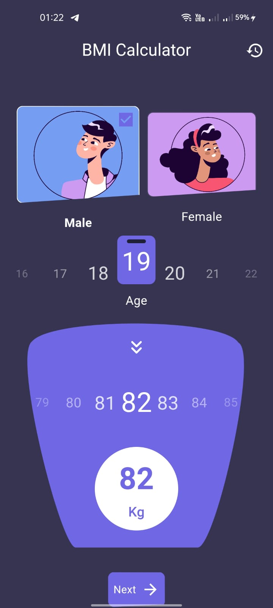
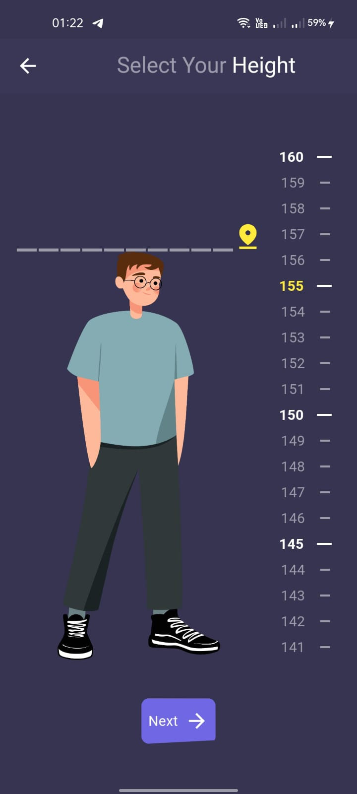
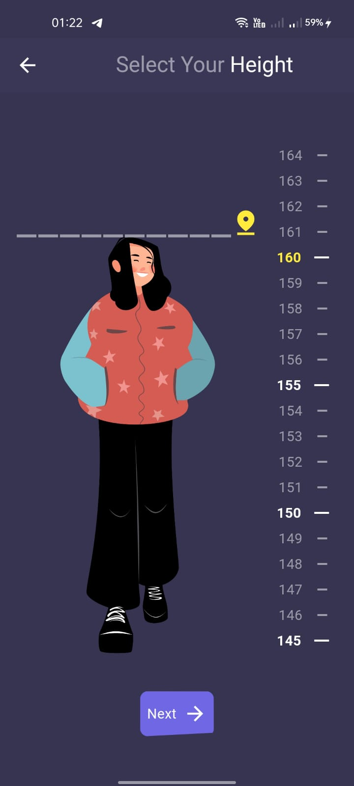
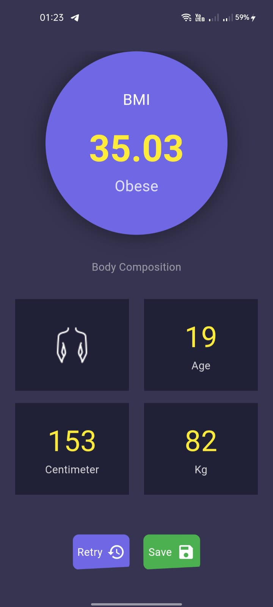
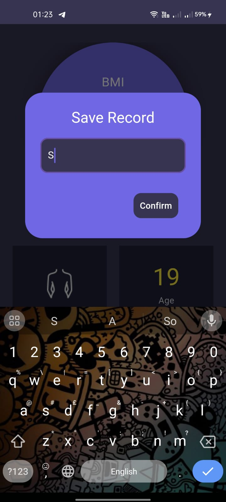

# BMI Flutter App

This is a BMI calculator app built using Flutter. It allows users to calculate their BMI based on their height and weight, save the result, and view previous records.

## Screenshots

### 1. Home Screen
The home screen allows users to input their height and weight.



### 2. Male Height Input
This screen shows the input for height when selecting male.



### 3. Female Height Input
This screen shows the input for height when selecting female.



### 4. No Records Screen
Displayed when no records are available.


### 5. Records Screen
Displays the saved BMI calculation records.


### 6. BMI Result Screen
Shows the calculated BMI result after inputting data.



### 7. Save Record Dialog
Users can save their BMI result with a custom name.



## Features
- Calculate BMI based on height and weight.
- Switch between male and female inputs.
- Save BMI records.
- View saved BMI records.

## How to Run the App
1. Clone the repository:
   ```bash
   git clone https://github.com/your-username/bmi-flutter.git
